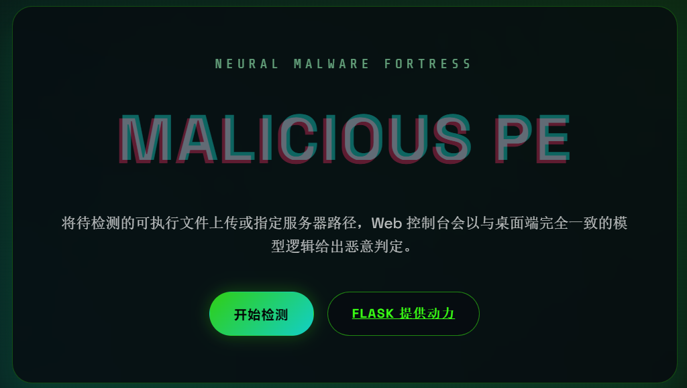
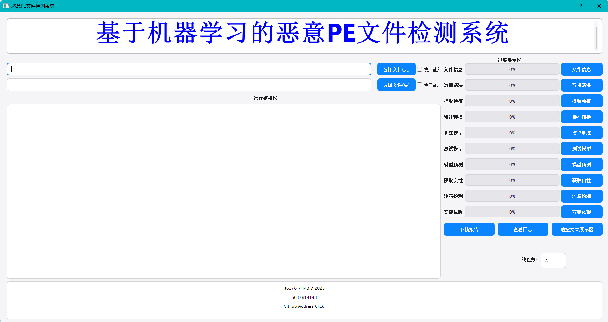

# Machine Learning for Malicious PE Detection | 基于机器学习的恶意 PE 检测

[English](#english) | [中文说明](#中文说明)

---

## English

### Overview

Machine Learning for Malicious PE Detection is an end-to-end desktop and web toolkit for analyzing Portable Executable (PE) files. It combines automated feature extraction, LightGBM based modeling, progress aware PyQt5 workflows, and HTML reporting so that analysts can move from raw samples to production ready detectors without leaving the project.

An online demo is available at **http://1.95.159.199** (upload an `.exe` to receive a detection report).



### Key capabilities

- Complete pipeline: raw `.exe` -> JSONL features -> NPZ vectors -> trained LightGBM model -> batch or interactive predictions.
- Desktop GUI with asynchronous tasks, real time logs, HTML reports, and on the fly threshold tuning.
- Optional Flask service that mirrors the GUI prediction flow for remote submissions.
- Automatic report generation stored under `docs/` for audit and threat intelligence workflows.
- Script helpers (`scripts/`) for cleaning datasets, scheduling jobs, and installing runtime dependencies on air gapped hosts.

### Tech stack

| Area | Details |
| --- | --- |
| Languages | Python 3.10+, NumPy/SciPy ecosystem |
| UI | PyQt5 (custom QSS themes, async task runner, HTML previews) |
| Modeling | scikit learn utilities, LightGBM classifiers, numpy/npz datasets |
| Feature engineering | `pefile`, `lief`, `capstone`, custom parsers in `core/feature_engineering` |
| Backend | Flask 3, Werkzeug, optional REST deployment |
| Tooling | `rich` logging, `tqdm` progress bars, `frida` and `networkx` for advanced analyses |

### Repository layout

```
machine/
├── app/                 # PyQt5 application (main window, tasks, UI resources)
├── core/                # Data processing, feature engineering, modeling, reporting
├── Flask/               # HTTP service that reuses the core pipeline
├── data/                # Raw, processed, quarantine, and model artifacts
├── docs/                # Generated analysis reports (HTML/Markdown)
├── scripts/             # Dataset utilities, installers, helpers
├── tests/               # Unit and integration tests
├── PNG/                 # Screenshot assets for documentation
├── thesis.md            # Full technical write-up
└── simple_thesis.md     # Shorter thesis or presentation notes
```

### Quick start

```powershell
python -m venv .venv
.\\.venv\\Scripts\\activate
pip install -r requirements.txt
python app\\main.py             # launch the desktop GUI
```

> If `lightgbm`, `pefile`, or `lief` compilation fails on your platform, run `python scripts\\PIP_INSTALL.py` for an automated retry with mirrors configured inside the script.

### Dataset preparation

1. Place benign samples in `data/raw/benign/` and malicious samples in `data/raw/malware/`. You can add `data/raw/test/` for hold out evaluation.
2. Keep suspicious or corrupted samples under `data/quarantine/invalid/` so they do not pollute the training corpus.
3. Larger intermediate products are created automatically:
   - Extracted features -> `data/processed/jsonl/*.jsonl`
   - Vectorized datasets -> `data/processed/npy|npz/`
   - Trained models -> `data/processed/models/` or root level `model.txt`

### Desktop GUI workflow

1. **Launch** - `python app/main.py` loads the themed PyQt5 interface with task shortcuts on the left pane.
2. **Feature Extraction** - choose a source folder (benign or malware) and an output `.jsonl`. Multithreading and realtime writes are configurable in the dialog.
3. **Feature Conversion** - convert the merged `.jsonl` file into `.npz` vectors ready for model training.
4. **Model Training** - feed `.npy` or `.npz` data to train LightGBM models. Use the threshold slider to trade recall vs precision; the resulting model is saved as `model.txt`.
5. **Model Testing** - evaluate accuracy and false positive rate on a validation split and display visual summaries.
6. **Model Detection** - batch scan arbitrary folders using the active model; export interactive HTML or Markdown reports directly to `docs/`.

The GUI task runner (`app/tasks/default_tasks.py`) streams logs and progress updates so that long running jobs remain responsive.

### Flask service

Serve the detector over HTTP when you need remote automation:

```powershell
python -m Flask.app --host 0.0.0.0 --port 8000 --debug
```

Upload endpoints mirror the GUI detection flow and reuse the same `core` modules, enabling consistent results between desktop and server deployments.

### Reports and documentation

- `docs/` - recent detection reports generated by the GUI (Markdown plus HTML snippets).
- `thesis.md` / `simple_thesis.md` - research background, methodology, benchmarking notes.
- `README_CHINESE.md` - full Chinese only version of this document.

### Testing and contribution

- Run `pytest` from the repository root to execute the suites under `tests/`.
- Keep new modules documented and register long running background work via the task registry in `app/tasks/registry.py`.
- Issues and pull requests are welcome - describe datasets used and attach anonymized logs where possible.

---

## 中文说明

### 项目简介

本项目提供一个端到端的恶意 PE 文件检测工具集，集成了特征提取、LightGBM 建模、PyQt5 桌面应用、HTML 报告和 Flask Web 服务。通过统一代码即可完成从样本采集到模型上线的整条链路。

在线体验地址 http://1.95.159.199 ,上传 `.exe` 即可生成检测报告。



### 核心特性

- 完整流程：原始 `.exe` -> `.jsonl` 特征 -> `.npz` 向量 -> LightGBM 模型 -> 批量或交互式检测。
- PyQt5 桌面端支持异步任务、实时日志、阈值调优与富文本报告。
- Flask 服务对桌面端检测能力做镜像，方便远程提交样本或接入自动化平台。
- `docs/` 中自动留存的检测报告方便审计、复现与威胁情报沉淀。
- `scripts/` 中的实用脚本可用于批处理数据、快速安装依赖或在沙箱中运行任务。

### 技术栈

| 模块 | 说明 |
| --- | --- |
| 编程语言 | Python 3.10+（NumPy / SciPy / scikit-learn / LightGBM） |
| 桌面端 | PyQt5 自定义主题、任务调度、HTML 预览 |
| 特征工程 | `pefile`、`lief`、`capstone` 与 `core/feature_engineering` 中的解析器 |
| 后端 | Flask 3 + Werkzeug，兼容 WSGI 部署 |
| 辅助 | `rich` 打印、`tqdm` 进度条、`frida`、`networkx` 等高级分析库 |

### 目录速览

```
machine/
├── app/（PyQt5 主程序与任务）
├── core/（数据处理、特征工程、建模、报告）
├── Flask/（HTTP 服务端）
├── data/（raw/processed/quarantine/model artifacts）
├── docs/（检测报告）
├── scripts/（脚本工具）
├── tests/（测试用例）
└── PNG/、thesis.md 等支撑文档
```

### 安装步骤

```powershell
python -m venv .venv
.\\.venv\\Scripts\\activate
pip install -r requirements.txt
```

如需自动解决镜像或依赖问题，可执行 `python scripts\\PIP_INSTALL.py`。

### 数据准备

1. 将良性样本放在 `data/raw/benign/`，恶意样本放在 `data/raw/malware/`，额外测试集可放在 `data/raw/test/`。
2. 将损坏或来源可疑的文件单独放入 `data/quarantine/invalid/`，避免污染训练数据。
3. GUI 会自动生成后续产物：`data/processed/jsonl/`、`data/processed/npy|npz/`、`data/processed/models/` 以及根目录下的 `model.txt`。

### GUI 工作流

1. **启动**：运行 `python app/main.py`。
2. **提取特征**：分别对良性和恶意样本产出 `.jsonl`，支持多线程与实时写入。
3. **特征转换**：将合并后的 `.jsonl` 转换成 `.npz` 向量。
4. **模型训练**：基于 `.npy` 或 `.npz` 训练 LightGBM，可调节阈值并导出 `model.txt`。
5. **模型测试**：查看准确率、误报率以及可视化指标。
6. **模型检测**：对任意目录进行批量扫描并生成 HTML 或 Markdown 报告（默认写入 `docs/`）。

任务执行过程中的进度与日志会实时显示，避免 GUI “无响应”。

### Flask 服务

```powershell
python -m Flask.app --host 0.0.0.0 --port 5000
```

HTTP 接口与桌面版完全复用同一套核心组件，可直接接入自动化流程或对外提供 API。

### 报告与文档

- `docs/`：近期检测报告与日志。
- `thesis.md` / `simple_thesis.md`：论文、设计文档与实验记录。
- `README_CHINESE.md`：单独的中文版使用说明。

### 测试与协作

执行 `pytest` 可运行 `tests/` 下的测试。欢迎通过 Issue / PR 反馈体验、提交改进或分享新的样本集——请附带可复现的信息与必要的脱敏日志。

---

保持关注后续更新（模型评估、可视化增强、在线检测优化等），也欢迎提出建议或需求。
