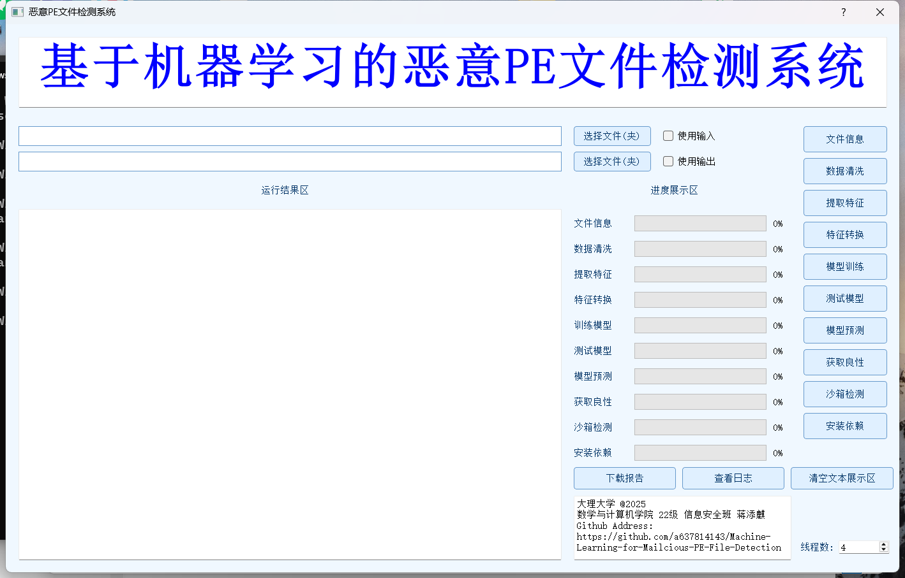

# 基于机器学习的恶意 PE 文件检测系统

## 项目简介 & 体验

您可以访问 http://1.95.159.199 来体验这个项目，上传 exe 文件即可检测并下载报告


此项目使用 `PyQt5` 完成 `GUI` 的构建，能够使用 `GUI` 进行完整的训练及测试流程，并对 PE 文件进行报告式的总结，耗时任务进度采用异步传输，并在 `GUI` 中显示，执行 `提取特征` -> `特征转换` -> `模型训练` 即可获得模型文件，然后你可以修改阈值来使准确性提高。
(more exes -> jsonl -> npz -> model)



## 项目结构

```
Machine-Learning-for-Malicious-PE-File-Detection-main/
├── PNG
├── docs/
├── data/
│   ├── processed/
│   │   ├── jsonl/
│   │   ├── models/
│   │   └── npy/
│   ├── quarantine/
│   │   └── invalid/
│   └── raw/
│       ├── benign/
│       ├── malware/
│       └── test/
├── app/
│   ├── main.py
│   ├── tasks/
│   │   ├── __init__.py
│   │   ├── default_tasks.py
│   │   └── registry.py
│   └── ui/
│       ├── __init__.py
│       ├── main_window.py
│       ├── progress_dialog.py
│       ├── report_view.py
│       └── resources.py
├── core/
│   ├── report_builder.py
│   ├── data_processing/
│   │   └── dataset_loader.py
│   ├── feature_engineering/
│   │   ├── __init__.py
│   │   ├── feature_utils.py
│   │   ├── pe_parser.py
│   │   ├── static_features.py
│   │   └── vectorization.py
│   ├── modeling/
│   │   ├── model_factory.py
│   │   └── trainer.py
│   └── utils/
│       ├── logger.py
│       └── visualization.py
├── Flask/
│   ├── __init__.py
│   ├── app.py
│   └── routes.py
└── scripts/
    ├── D.py
    ├── DATA_CLEAN.py
    ├── FILE_NAME.py
    ├── GET_B.py
    ├── PIP_INSTALL.py
    ├── ROOT_PATH.py
    └── SENDBOX.py
```

## 使用方式

下载原始 exe 数据集（良性、恶意）并存储在不同位置，存放恶意文件的目录必须有单词 `malware` 字样

使用 GUI 的 `提取特征` 分别提取良性、恶意文件的特征，合并，打乱，产物为 `.jsonl` 文件

使用 GUI 的 `特征转换` 将上一步的 `jsonl` 文件转化为 `.npz` 文件，即向量化

使用 GUI 的 `模型训练` 功能将 `npy` / `npz` 文件训练为可使用的 `model.txt` 模型文件

使用 GUI 的 `模型测试` 功能测试模型的准确率和误报率

使用 GUI 的 `模型检测` 功能，使用根目录下的 `model.txt` 进行检测，或者使用 GUI 选择其他模型，直接对 exe 进行检测
